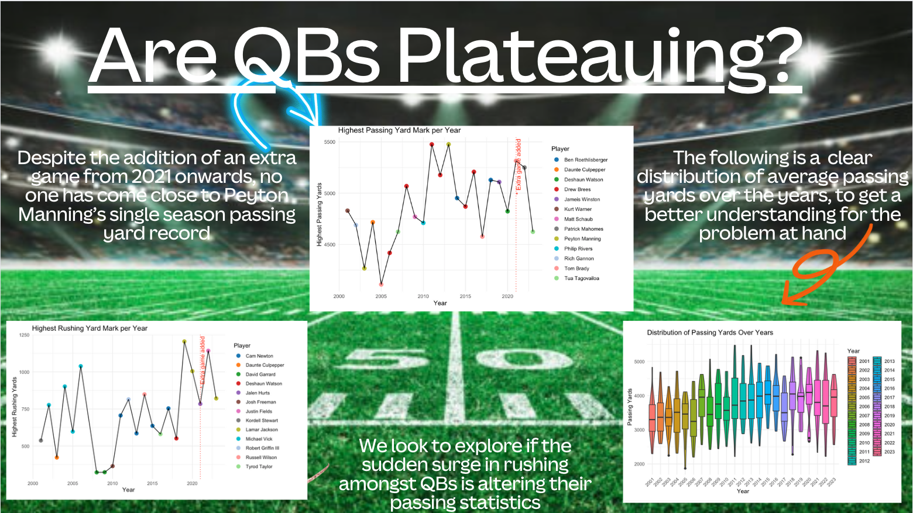

```{r, echo = FALSE}
library(distill)
library(ggplot2)
library(ggrain)
library(dplyr)
football_data = read.csv("passing_cleaned.csv", header = TRUE)
rushing_data = read.csv("rushing_cleaned.csv", header = TRUE)
football_data$Sufficient_Attempts <- ifelse(football_data$Att >= 20, "yes", "no")
filtered_data <- football_data[football_data$Att > 20 & football_data$GS > 12,]
library(GGally)
football_data$Yards <- ifelse(football_data$Yds < 2000, "low",
                              ifelse(football_data$Yds >= 2000 & football_data$Yds < 4000, "medium", "high"))
football_data$Yards <- factor(football_data$Yards, levels = c("low", "medium", "high"))
filtered_data$Yards <- ifelse(filtered_data$Yds < 2000, "low",
                              ifelse(filtered_data$Yds >= 2000 & filtered_data$Yds < 4000, "medium", "high"))
filtered_data$Yards <- factor(filtered_data$Yards, levels = c("low", "medium", "high"))
football_data$incompletions <- football_data$Att - football_data$Cmp
filtered_data$incompletions <- filtered_data$Att - filtered_data$Cmp
football_data$completion_rate <- football_data$Cmp / football_data$Att
filtered_data$completion_rate <- filtered_data$Cmp / filtered_data$Att
# Calculate highest passing yards per year
max_yards_per_year <- football_data %>%
  group_by(Year) %>%
  summarise(max_yards = max(Yds, na.rm = TRUE))
max_values <- football_data %>%
  group_by(Year) %>%
  summarise(max_TD = max(TD, na.rm = TRUE),
            max_Int = max(Int, na.rm = TRUE),
            .groups = "drop")  # Use .groups = "drop" to avoid grouped data
max_values_long <- max_values %>%
  tidyr::pivot_longer(cols = c(max_TD, max_Int), names_to = "Variable", values_to = "Max_Value")
# Calculate average passing touchdowns (TDs) by Year
avg_passing_tds <- football_data %>%
  group_by(Year) %>%
  summarise(avg_TD = mean(TD, na.rm = TRUE),
            .groups = "drop")  # Use .groups = "drop" to avoid grouped data
football_data <- football_data %>%
  mutate(age_group = case_when(
    Age <= 28 ~ "young",
    Age > 28 & Age <= 34 ~ "medium",
    Age > 34 ~ "old"
  ))
top_passers <- football_data %>%
  group_by(Year) %>%
  top_n(1, Yds) %>%
  ungroup()
top_passers <- top_passers %>%
  mutate(age_group = case_when(
    Age <= 28 ~ "young",
    Age > 28 & Age <= 34 ~ "medium",
    Age > 34 ~ "old"
  ))
age_group_counts <- top_passers %>%
  count(age_group)
football_data$FantasyPPG = ((football_data$Yds * .04) + (football_data$TD * 4) - (football_data$Int * 2)) / (football_data$G)
filtered_data$FantasyPPG = ((filtered_data$Yds * .04) + (filtered_data$TD * 4) - (filtered_data$Int * 2)) / (filtered_data$G)


```





Whilst working with this data, I realized that the passing statistics did not only include quarterback play, but rather any player who ever threw a pass from the year 2000 up until 2023. Obviously, this became problematic as several statistics were skewed by players who only had 1 pass attempt. Thus, I made a more concise data set which includes only players who started 75% of the games per season, as well as had over 1200 passing yards, as I thought that was a good way of determining starting quarterbacks throughout the years.

The first visualization at hand is the distribution of total passing yards per year throughout the entirety of the NFL. 

```{r, echo = FALSE}
# Violin plot of Passing Yards Distribution Over Years
ggplot(filtered_data, aes(x = factor(Year), y = Yds, fill = factor(Year))) +
  geom_violin() +
  geom_boxplot()+
  labs(x = "Year", y = "Passing Yards", fill = "Year") +
  ggtitle("Distribution of Passing Yards Over Years") +
  theme_minimal() +
  theme(axis.text.x = element_text(angle = 45, hjust = 1))  # Rotate x-axis labels

```
Here, we can see that the average passing yards per season has definitely increased since the early 2000's, however, despite an extra game being added in the 2021 season (and on wards), the average passing yards per season still does not top that of the average passing yards per season in the 2010's. We can also note the maximum passsing yards per season was the largest in 2011, and was close to getting beaten in 2013, however, since then, no one has gotten close. We can see this relationship more clearly in the following visualization.

```{r, echo = FALSE}
# Define a custom color palette with 13 distinct colors
custom_palette <- c("gold", "purple", "navyblue", "#bcbd22", "green",
                    "darkred", "blue3", "red", "orange", "#17becf",
                    "black", "#ff9896", "lightblue")

# Step 1: Summarize data to get max yards per player per year
max_yards_per_year <- filtered_data %>%
  group_by(Year, Player) %>%
  summarise(max_yards = max(Yds, na.rm = TRUE)) %>%
  ungroup() %>%
  group_by(Year) %>%
  slice(which.max(max_yards))  # Get the row with the maximum yards for each year

# Step 2: Plotting with ggplot
ggplot(max_yards_per_year, aes(x = Year, y = max_yards, color = Player)) +
  geom_point(size = 3) +  # Scatter plot of max yards per year
  geom_line(aes(group = 1), color = "black") +  # Add a solid black line connecting all points
  labs(x = "Year", y = "Highest Passing Yards", title = "Highest Passing Yard Mark per Year") +
  scale_color_manual(values = custom_palette) +  # Custom color scale
  theme_minimal() +
  # Add a vertical dotted red line at Year 2021 with annotation
  geom_vline(xintercept = 2021, linetype = "dotted", color = "red")


```
In this plot, we can see more precisely what the maximum passing yards per season is, while also showing which players were the one's to accomplish the feat. We note the dotted red line as a marker for when there was a major rule change (the change from a 16-game to a 17-game season). We see that from 2020 - 2021 there is almost an 1000 yard increase of maximum yards thrown. This makes sense as there is an additional game for all QBs to earn more yards. However, 2023 seems to be right on track with 2020. When I saw this , I was extremely surprised because I would expect passing yards to increase with an additional game in each season. After a little bit of pondering, I thought to explore the relationship between passing yards and rushing yards amongst quarterbacks. It is evident to most NFL fans that the quarterback position is completely changing. In the past, pocket passing quarterbacks such as Tom Brady, Drew Brees, and Peyton Manning saw a lot of success. However, now we see the importance of mobility amongst quarterbacks such as Lamar Jackson, Jalen Hurts, and Josh Allen. Now, we look to explore if this rise of mobility in modern day quarterbacks is having an effect on the passing statistics amongst quarterbacks.

Here, we have 2 treemaps in which the size of the rectangle/square is representative of the proportion of yards within the last 22 years. We look to compare the passing yards of quarterbacks by year and rushing yards of quarterback by year to see if there seem to be any patterns or correlation.

```{r, echo = FALSE}
# Create shelon_set by merging filtered_data and rushing_data
# Merge rushing touchdowns (rTD) into filtered_data for matching players and years
shelon_set <- filtered_data %>%
  inner_join(rushing_data, by = c("Player", "Year"))

library(treemap)
library(dplyr)

# Assuming 'football_data' is your dataset containing passing yards (Yds) by year (Year)

# Aggregate passing yards (Yds) by year
yearly_rushing_yards <- shelon_set %>%
  group_by(Year) %>%
  summarise(total_yards = sum(rYds, na.rm = TRUE))

# Create treemap with customized labels and options
treemap(yearly_rushing_yards, index = "Year", vSize = "total_yards",
        title = "Rushing Yards by Year",
        palette = "RdYlBu",
        fontsize.labels = c(12, 10),  # Adjust font sizes for labels
        fontsize.title = 14,  # Adjust font size for title
        align.labels = list(c("center", "center")),  # Center-align labels
        border.col = "black",  # Set border color
        overlap.labels = 0.5,  # Increase label overlap
        aspRatio = 1.5)  # Adjust aspect ratio


# Aggregate passing yards (Yds) by year
yearly_passing_yards <- shelon_set %>%
  group_by(Year) %>%
  summarise(total_yards = sum(Yds, na.rm = TRUE))

# Create treemap with customized labels and options
treemap(yearly_passing_yards, index = "Year", vSize = "total_yards",
        title = "Passing Yards by Year",
        palette = "RdYlBu",
        fontsize.labels = c(12, 10),  # Adjust font sizes for labels
        fontsize.title = 14,  # Adjust font size for title
        align.labels = list(c("center", "center")),  # Center-align labels
        border.col = "black",  # Set border color
        overlap.labels = 0.5,  # Increase label overlap
        aspRatio = 1.5)  # Adjust aspect ratio

```
After looking at these two treemaps, we can see some sort of pattern. For example, we see that 2022 was the year with the second largest amount of rushing yards by quarterbacks, while it had one of the lowest amounts of passing yards within the last 22 years. Similar patterns follow suit with the years 2020 and 2023. This relationship further shows how the new modern mobile quarterback era may be affecting passing yards per season.

In order to delve even further into this relationship, I decided to split the quarterbacks into a two separate categories based on their in season statistics. A quarterback will be considered a 'Mobile QB' if they net at least 500 rushing yards and 5 rushing touchdowns. If they fail to reach these margins, they will be considered 'Pocket Passers'. Of the 501 QB's in our modified data set throughout the last 20+ years, we find that there are only 34 that are considered to be mobile, whilst 467 QB's are considered to be 'Pocket Passer'. The following visualization shows the individual distribution of 'Pocket Passers' and 'Mobile QB's' over the years.  


```{r, echo = FALSE}
library(ggridges)
library(dplyr)
library(ggplot2)

# Update QB_Type based on conditions
shelon_set <- shelon_set %>%
  mutate(QB_Type = ifelse(rYds > 400 & rTD > 4, "Mobile QB", "Pocket Passer"))

# Create the plot
p <- ggplot(shelon_set, aes(x = Year, y = QB_Type, fill = QB_Type)) +
  geom_density_ridges(scale = 3, alpha = 0.6) +
  theme_ridges() +
  scale_fill_manual(values = c("orange", "skyblue"), guide = FALSE) +
  labs(x = "Year", y = "QB Type", title = "Distribution of Mobile QBs vs Pocket Passers Over Years") +
  theme_minimal()

# Add vertical lines at specific years
p + geom_vline(xintercept = c(2000, 2023), linetype = "dotted", color = "red")

```
Here, we can clearly see the surge in 'Mobile QB's' throughout the last few years, while 'Pocket Passers' seem to be declining. This can definitely help explain why we are seeing a decrease in passing yards within the last few seasons.


In order to take a deeper look into the direct comparisons of certain Quarterbacks passing and rushing stats, I have provided an interactive plot in which the user can input a Quarterback who started 75% of a season throughout the years 2001-2023 and a plot will show their distribution of yards in both respective categories over the years. Users may choose to use this as a means of comparing stats among certain quarterbacks, or to see trends in the decrease of passing yards and increase in rushing yards amongst certain quarterbacks.

<iframe src="https://abby-flynt.shinyapps.io/QB-Statistics/" class="l-screen-inset shaded" height="1000px"></iframe>

Now, what exactly has all of this data shown us? Well, it is clear that passing production in the NFL is no where near what it was like from 2011-2016. One of the reasons why this may be is because of the sheer pocket passing quarterbacks that played during this era. If you look at the passing vs rushing stats for players such as Drew Brees, Tom Brady, Philip Rivers, Peyton Manning, etc... it is evident that they were the most prolific passers in the league, and rarely ever ran with the ball. Meanwhile, the prolific passers in the NFL in the more modern era seem to favor running the ball a little bit more. This is seen with quarterbacks such as Josh Allen, Jalen Hurts, Lamar Jackson, etc... We also established a surge of mobile quarterbacks in the more recent years, furthermore proving that rushing amongst quarterbacks is affecting the passing game in the NFL. Although this may not in turn be problematic for the NFL, it may have a long-term affect, such as making it harder for players to beat previous passing records. All-in-all, this data helped show that there indeed is a reason behind the decline in passing yards over the recent seasons, and several factors have to do with it.


