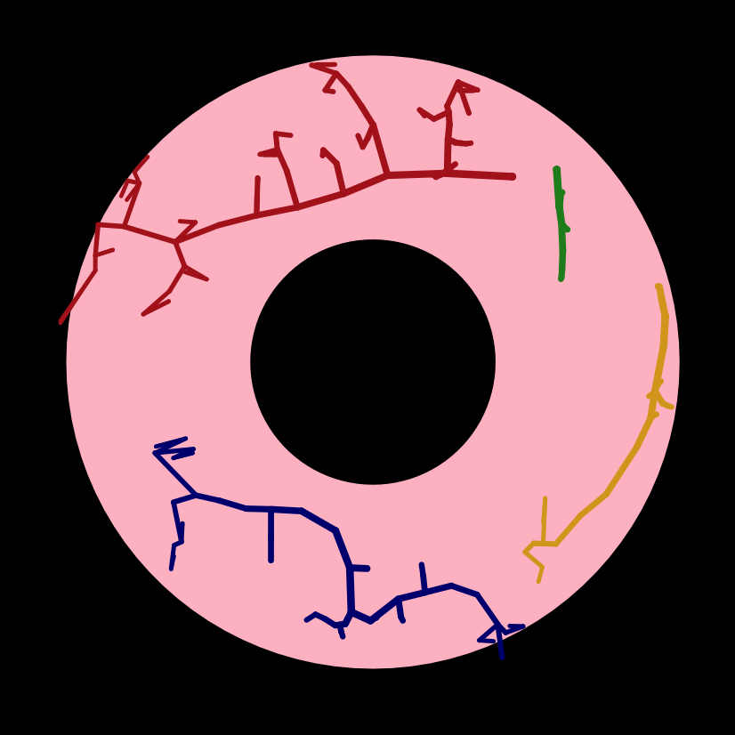
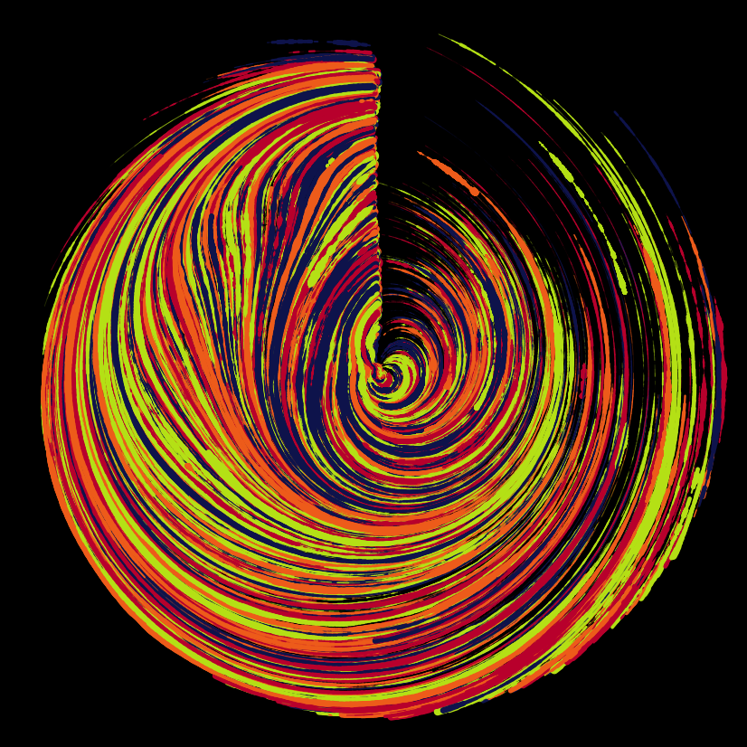
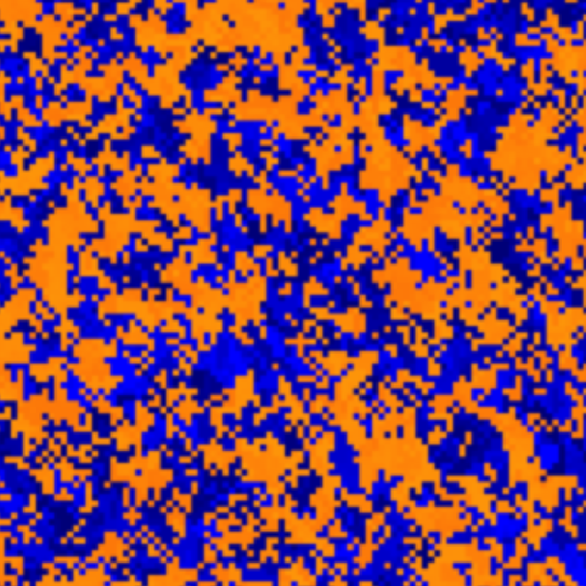

```{r setup, include=FALSE}
knitr::opts_chunk$set(echo = FALSE)
```

```{r}
library(aRtsy)
```


```{r, echo = FALSE, eval = FALSE}
set.seed(2)
art1 = canvas_petri(colors = colorPalette("tuscany1"), background = "black", dish = "pink", attractors = 50, iterations = 25, hole = 0.4)
saveCanvas(art1, filename = "art1.png")
art1

```



When creating this visualization I found that it resembles an eyeball, or petri-dish shape. 


```{r, echo = FALSE, eval = FALSE}
set.seed(100)
art2 = canvas_flow(color = colorPalette("retro3"), background = "black", lines = 2000, lwd = 0.25, iterations = 1000, stepmax = 0.01, outline = "none", polar = TRUE)
saveCanvas(art2, filename = "art2.png")
art2
```

When I first created this visualization, I had the spiral go all the way around. Then, I found a way to alter how long the spiral is (determining whether it fills the whole circle). I wanted to create a spiral that was dense in bright colors, hence the black background, and settled for a 3/4 spiraling circle. 


```{r, echo = FALSE, eval = FALSE}
set.seed(250)
custom_palette = c(colorRampPalette(c("blue", "darkblue"))(20), colorRampPalette(c("orange", "darkorange"))(20))
art3 = canvas_smoke(colors = custom_palette, init = 2000, shape = "bursts", algorithm = "minimum", resolution = 100)
saveCanvas(art3, filename = "art3.png")
art3
```


For this visualization, I fulfilled the requirement of using a visualization containing my universities [Bucknell's] colors. I thought that this 'smoke' effect with orange and blue could look cool. My first draft consisted of only one orange and one blue. Later, I added another shade of each color, to add slightly more variation in the colors, while still achieving what was required.